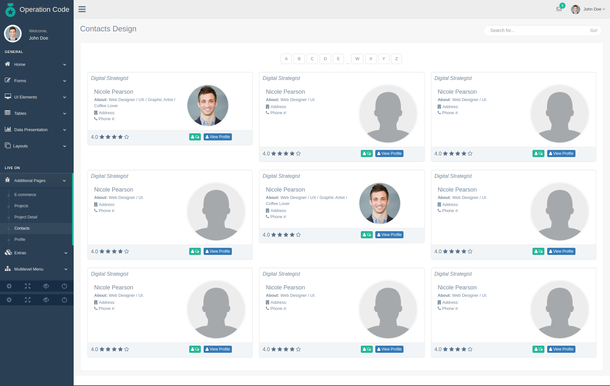
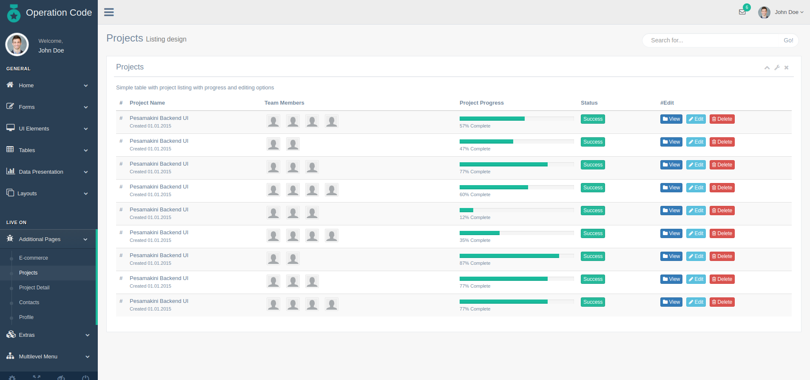

# Operation Code Jobs Portal

-------
### Demo: => [Jobs Portal](https://sethbergman.engineer) <=

#### Contacts Design:

#### Projects Design:

This is not yet a MVP. It's a bootstrap UI framework, currently running on an express backend.
I have an Aurelia app inside the app folder, which is where the majority of future development will be done. The Aurelia Framework uses ES6 classes and aligns closely with web standards, making it easy for developers already familiar with HTML, CSS, JS and frameworks like the MEAN Stack to jump in and feel confident about how things work.

I recommend their documentation very highly, as it's well maintained and getting better.

#### Feedback and PR's are encouraged :rocket:
